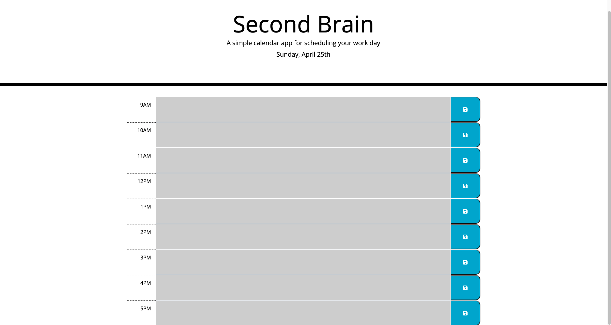

# Second Brain Work Day Scheduler
> This web application gives you the power of a second brain. You're an employee with a busy schedule and need to add important events to a daily planner so you can manage your time effectively. 

## Table of contents
* [General info](#general-info)
* [Team members](#team-members)
* [Technologies](#technologies)
* [Languages](#languages)
* [Third Party APIs](#third-party-apis)
* [Screenshots](#screenshots)
* [View updates](#view-updates)

## General info
Everyone would love a personal assistant but that's not reality. As personal assistant technology grows, so does the dependency on it but not all have to be complicated. Something as simple as Second Brain can follow you throughout the day to help you keep on track. With color coordination, automatic date/time change, and the ability to save your scheduled activities. Coding libraries such as Moment.js expand the possibilities to make things like this possible. 

## Team members 
Jonathan X. Flores :technologist: 
>You can find me on [Linkedin](https://www.linkedin.com/in/jonathanxflores "Add me on Linkedin") or email me at <jgflores35@gmail.com>
	
## Technologies 
Project is created with :computer: :
* Visual Studio Code version: 1.54.3
* Terminal version: 2.11
* Google Chrome version: 89.0.4389.72
* GitHub

## Lanaguages
Project is created with:
* HTML
* CSS
* JavaScript

## Third Party APIs
Project is created with:
* Moment.js
* JQuery
* CDNJS
* Google Fonts
* Font Awesome
* Bootstrap

## Screenshots 
The following screenshots are what the website currently looks like :camera_flash: :

	
## View updates
To view the website live, go to: http://jonathanxflores.me/second-brain/ or to open Github repository files on a browser, go to: https://github.com/brownradical/second-brain
